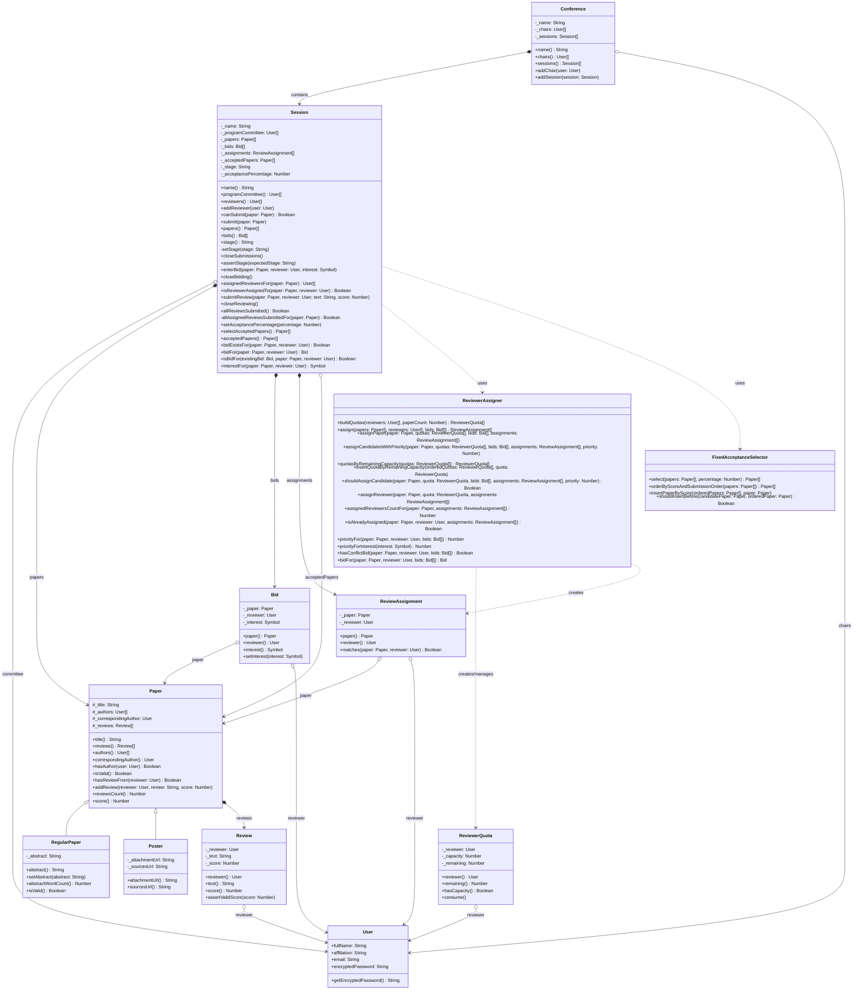

# ComfyChair - Documentación Técnica del Proyecto

Este documento provee la descripción técnica de la arquitectura, modelo de dominio, flujos funcionales y decisiones de diseño del sistema **ComfyChair**, correspondientes al estado final e implementado de la Parte 1.

---

## 1. Propósito del Sistema

ComfyChair modela y automatiza el proceso de gestión de artículos para una conferencia científica. El objetivo del dominio es cubrir, por sesión (*track*), el ciclo de vida completo de un artículo:
1. Recepción de trabajos en formato Regular o Poster.
2. Expresión de interés (*bidding*) por parte de los revisores.
3. Asignación de revisores a artículos (respetando carga equitativa y conflicto de interés).
4. Carga de revisiones (evaluaciones de texto y score).
5. Selección final de artículos aceptados por corte fijo porcentual.

---

## 2. Stack y Estructura del Repositorio

### 2.1 Stack Tecnológico
* **Runtime:** Node.js (versión 18 o superior)
* **Testing:** Jest (`^29.7.0`)
* **Paradigma:** Orientación a Objetos pura con estado encapsulado en clases JavaScript (CommonJS, `require/module.exports`).
* **Estilo de programación:** Sin lambdas ni funciones anónimas en el código productivo fuera de los métodos nativos de colecciones, usando bucles tradicionales e imperativos estructurados para mayor legibilidad y apego a las convenciones de la cátedra.

### 2.2 Estructura de Archivos
```text
src/
  Bid.js                     # Clase Bid y enum de Interests (Symbol)
  Conference.js              # Entidad contenedora general
  FixedAcceptanceSelector.js # Algoritmo de selección por corte fijo
  Paper.js                   # Clase base abstracta de artículo
  Poster.js                  # Especialización para Posters
  RegularPaper.js            # Especialización para Artículos Regulares
  Review.js                  # Clase Review con validación de score
  ReviewAssignment.js        # Clase de asociación para asignaciones
  ReviewerAssigner.js        # Algoritmo de asignación y cálculo de cuotas
  ReviewerQuota.js           # Estructura de control de cuotas por revisor
  Session.js                 # Agregado raíz y orquestador del flujo
  User.js                    # Representación de usuario con password hashing
tests/
  Bid.test.js
  Paper.test.js
  Poster.test.js
  RegularPaper.test.js
  Review.test.js
  ReviewerAssigner.test.js
  Session.test.js
  SessionAssignment.test.js
  SessionReviewing.test.js
  SessionSelection.test.js
  SessionWorkflow.test.js
docs/
  DECISIONES.md              # Registro detallado de decisiones de diseño
  DOCUMENTACION_TECNICA.md   # Descripción técnica integral del sistema
  dev-cycle/                 # Planes y devoluciones del ciclo de desarrollo
ENUNCIADO.md                 # Enunciado oficial de la Parte 1
PLAN.md                      # Plan de implementación técnica original
README.md                    # Guía rápida de inicio
```

---

## 3. Diagrama de Clases Completo

El siguiente diagrama en formato Mermaid representa el modelo de objetos actual del sistema, detallando sus atributos, métodos e interrelaciones:



---

## 4. Clases del Modelo de Dominio

### 4.1. `User`
Representa a una persona (autor, revisor, chair) en la plataforma. Realiza un hashing SHA-256 en Base64 de la contraseña provista durante su construcción.

### 4.2. `Conference`
Agrupa las sesiones (`Session`) y a los organizadores generales (`_chairs`).

### 4.3. `Paper` (Clase Base)
Abstracción de artículo que custodia los datos comunes: título, autores, autor corresponsal y revisiones recibidas.
* **Invariante:** El autor corresponsal debe estar incluido en la lista de autores.
* **Capacidad máxima de revisión:** El máximo de revisiones permitidas por artículo se centraliza en la constante estática `Paper.allowedReviews = 3`.
* **Score:** Se calcula como el promedio matemático simple de los puntajes de sus revisiones. Devuelve `0` si no cuenta con revisiones.

### 4.4. `RegularPaper`
Especialización de `Paper` que añade un abstract de texto.
* **Validación:** El abstract no puede exceder las 300 palabras.

### 4.5. `Poster`
Especialización de `Paper` que incluye URLs para el adjunto principal y para los fuentes del poster. No añade validaciones extra sobre las heredadas.

### 4.6. `Review`
Representa la evaluación individual hecha por un revisor.
* **Invariante:** El puntaje (`score`) debe ser un entero válido comprendido en el rango $[-3, +3]$.

### 4.7. `Bid`
Representa el nivel de interés declarado por un revisor en relación a un artículo específico.
* **Valores admitidos:** `Interested`, `Maybe`, `NotInterested`, `Conflict` (todos de tipo `Symbol`).

### 4.8. `ReviewAssignment`
Clase de asociación inmutable que representa formalmente la asignación de un revisor a un determinado artículo.

### 4.9. `ReviewerQuota`
Clase auxiliar que gestiona el límite de carga laboral asignado a un revisor individual, calculando su capacidad máxima y controlando el cupo restante durante el algoritmo.

### 4.10. `ReviewerAssigner`
Contiene la lógica pura del algoritmo de asignación. Distribuye la carga en cuotas y procesa secuencialmente prioridades, reutilizando `Paper.allowedReviews` para expresar la cantidad obligatoria de revisores por artículo.

### 4.11. `FixedAcceptanceSelector`
Contiene el algoritmo de selección de papers por corte fijo, ordenándolos descendentemente por score y orden de envío como criterio secundario ante empates.

### 4.12. `Session`
Agregado raíz del dominio que modela el ciclo del track y coordina todas las llamadas del flujo, manteniendo el historial de etapas (`Receiving -> Bidding -> Reviewing -> Selection`).
* **Encapsulación de etapas:** la mutación interna del stage se realiza con `#setStage(stage)`, mientras que la API pública expone solo transiciones de negocio.
* **Consulta de bids:** `interestFor(...)` devuelve el interés solo si existe un `Bid` explícito; de lo contrario informa el error de forma descriptiva.
* **Cierre de reviewing:** `closeReviewing()` exige que cada reviewer asignado haya enviado su review, evitando falsos positivos por reviews cargadas por terceros.

---

## 5. Ciclo de Vida y Flujo Funcional de una Sesión

El ciclo transiciona secuencialmente de forma manual mediante métodos dedicados de `Session`:

### 5.1. Etapa `Receiving`
* Se aceptan envíos de artículos válidos mediante `submit(paper)`. Los autores pueden editar sus artículos.

### 5.2. Etapa `Bidding`
* Se ingresa tras invocar a `closeSubmissions()`.
* Los revisores del comité pueden registrar o actualizar sus bids mediante `enterBid(paper, reviewer, interest)`.
* No se permiten nuevos envíos de artículos.

### 5.3. Etapa `Reviewing`
* Se ingresa mediante `closeBidding()`, lo que dispara internamente el algoritmo de `ReviewerAssigner`.
* **Algoritmo de Asignación:**
  1. Calcula la cuota por revisor de forma equitativa: `cuotaBase = Math.floor(Paper.allowedReviews * A / R)`. Distribuye el `resto` asignando una unidad más de carga a los primeros `resto` revisores.
  2. Para cada artículo, busca asignar exactamente `Paper.allowedReviews` revisores.
  3. Intenta asignar revisores con cupo disponible respetando prioridades de bid: `Interested` (Prioridad 0) -> `Maybe` (Prioridad 1) -> Ausencia de Bid (Prioridad 2) -> `NotInterested` (Prioridad 3).
  4. Excluye a revisores con conflicto (autores del paper o con bid explícito de `Conflict`).
  5. Ante candidatos con la misma prioridad de bid, prioriza al revisor que tenga mayor capacidad restante (`remaining()`).
  6. Si no es posible asignar exactamente `Paper.allowedReviews` revisores a cada artículo, la transacción falla atómicamente arrojando un error y la sesión permanece en `Bidding`.
* Los revisores asignados cargan su revisión a través de `submitReview(...)`. No se permiten revisiones de usuarios no asignados o duplicadas por el mismo revisor.

### 5.4. Etapa `Selection`
* Se accede a través de `closeReviewing()`, el cual verifica que cada artículo tenga reviews de todos sus revisores asignados. Dado que la asignación garantiza `Paper.allowedReviews` revisores por paper y `Paper` limita la misma cantidad de reviews, esto preserva la regla de 3 revisiones obligatorias sin aceptar reviews de usuarios no asignados.
* Se define el porcentaje de aceptación en la sesión mediante `setAcceptancePercentage(percentage)`.
* Al ejecutar `selectAcceptedPapers()`, el selector ordena los papers descendentemente por score y por orden de envío, y selecciona hasta $\lfloor \frac{\text{totalPapers} \times \text{porcentaje}}{100} \rfloor$.

---

## 6. Cobertura de Pruebas Automatizadas

La solución está completamente probada usando Jest en modo secuencial.

* **Suites de test implementadas:** 11 suites, compuestas por 53 tests totales en verde.
* **Cobertura global de código:** **96.25%** de statements, **94.84%** de branches, **94.04%** de functions y **96.16%** de lines.
* **Suites destacadas de flujo:**
  * `ReviewerAssigner.test.js`: Valida el algoritmo de cuotas y prioridades de forma aislada.
  * `SessionAssignment.test.js`: Valida la asignación integrada en la sesión y bloqueos por conflictos.
  * `SessionReviewing.test.js`: Valida las restricciones y el flujo de carga de revisiones.
  * `SessionSelection.test.js`: Valida el cálculo de corte fijo y el orden determinista en empates.
  * `SessionWorkflow.test.js`: Test integrador de punta a punta cubriendo todas las etapas en un flujo de negocio completo.

Para ejecutar los tests, utilice:
```bash
npx jest --runInBand
```

---

## 7. Referencias

* Para un detalle minucioso sobre justificaciones de diseño, consulte [DECISIONES.md](./DECISIONES.md).
* Para consultar los requisitos de entrega originales, vea [ENUNCIADO.md](./ENUNCIADO.md).
