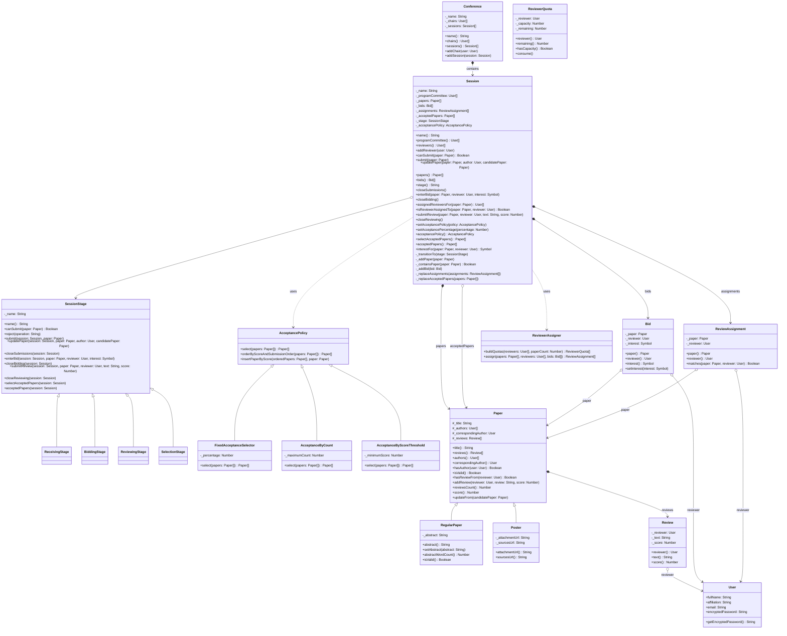

# ComfyChair - Documentacion tecnica del proyecto

Este documento describe la arquitectura actual del sistema ComfyChair en la Parte 2.

## 1. Proposito

ComfyChair modela la gestion de articulos de una conferencia cientifica. En esta version, el flujo completo de una sesion se organiza con objetos State y la seleccion final se resuelve con politicas intercambiables.

## 2. Estructura del repositorio

```text
src/
  AcceptancePolicy.js
  AcceptanceByCount.js
  AcceptanceByScoreThreshold.js
  Bid.js
  Conference.js
  FixedAcceptanceSelector.js
  Paper.js
  Poster.js
  RegularPaper.js
  Review.js
  ReviewAssignment.js
  ReviewerAssigner.js
  ReviewerQuota.js
  Session.js
  User.js
  stages/
    SessionStage.js
    ReceivingStage.js
    BiddingStage.js
    ReviewingStage.js
    SelectionStage.js
tests/
  AcceptanceByCount.test.js
  AcceptanceByScoreThreshold.test.js
  Bid.test.js
  Paper.test.js
  Poster.test.js
  RegularPaper.test.js
  Review.test.js
  ReviewerAssigner.test.js
  Session.test.js
  SessionAssignment.test.js
  SessionPaperUpdate.test.js
  SessionReviewing.test.js
  SessionSelection.test.js
  SessionStages.test.js
  SessionWorkflow.test.js
README.md
ENUNCIADO_TP1.md
ENUNCIADO_TP2.md
```

## 3. Diagrama de clases



## 4. Resumen de responsabilidad de clases

- `Session` coordina el flujo y delega el comportamiento variable en `SessionStage`.
- `ReceivingStage`, `BiddingStage`, `ReviewingStage` y `SelectionStage` encapsulan las reglas de cada etapa.
- `AcceptancePolicy` define la interfaz comun de seleccion.
- `FixedAcceptanceSelector`, `AcceptanceByCount` y `AcceptanceByScoreThreshold` implementan politicas intercambiables.
- `ReviewerAssigner` sigue manejando la asignacion equitativa de revisores.
- `Paper`, `RegularPaper` y `Poster` conservan las invariantes del dominio.

## 5. Cobertura funcional

Las suites de tests cubren:
- actualizacion de papers durante recepcion,
- transiciones validas e invalidas entre etapas,
- asignacion y revision de papers,
- seleccion por porcentaje, por cantidad y por umbral,
- aislamiento entre politicas de distintas sesiones.
